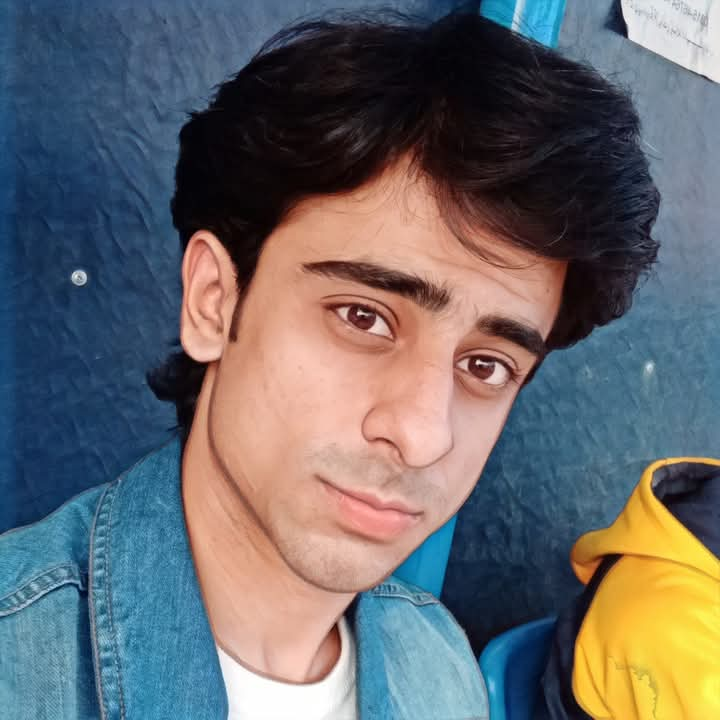

# Syed Irtza Kamal
<!DOCTYPE html>
<html lang="en">
<head>
  <meta charset="UTF-8" />
  <meta name="viewport" content="width=device-width, initial-scale=1.0"/>
  <title>Syed Irtza Kamal - Resume</title>
  
</head>
<body>
  

    

      
      <h2>Syed Irtza Kamal</h2>
      

        <h3>Contact</h3>
        
<strong>Phone:</strong> +92 332 8641677

        
<strong>Email:</strong> irtza.kamal@gmail.com

        
<strong>Location:</strong> Sialkot, Pakistan

      

      

        <h3>Skills</h3>
        <ul>
          <li>C++</li>
          <li>HTML & CSS</li>
          <li>Graphic Design</li>
          <li>Public Speaking</li>
          <li>Digital Marketing</li>
          <li>Content Creation</li>
          <li>Brand Promotion</li>
          <li>WordPress & Shopify</li>
          <li>Fitness Coaching</li>
          <li>Islamic Research</li>
        </ul>
      

      

        <h3>Languages</h3>
        
English

        
Urdu

      

    

    

      <h1>Syed Irtza Kamal</h1>
      <h2>Full Stack Learner | Designer | Developer</h2>

      

        <h3>About Me</h3>
        
I am a passionate and multi-talented individual with a strong dedication to learning, building, and creating. With expertise in software development, design, marketing, and public speaking, I strive to merge creativity with functionality in everything I do. My journey is driven by curiosity, self-growth, and the desire to positively impact others—whether through developing websites, creating engaging content, or mentoring others in fitness and life skills. A full-stack learner, a brand builder, and a speaker at heart, I believe in growth through persistence and purpose.

      

      

        <h3>Education</h3>
        

          <h4>Harvard Grammar High School – Sialkot (2007–2019)</h4>
          
Matriculation – 93.8%

        

        

          <h4>Govt Allama Iqbal College for Boys – Sialkot (2019–2021)</h4>
          
FSc Pre-Medical – 93.6%

        

        

          <h4>University of Management and Technology – Sialkot</h4>
          
BS Software Engineering (Present)

        

      

      

        <h3>Experience</h3>
        

          <h4>1. C++ Developer (2022–Present)</h4>
          <ul>
            <li>Object-Oriented Programming & Data Structures</li>
            <li>Built airline ticket reservation systems and other class projects</li>
          </ul>
        

        

          <h4>2. Web Developer (2023–Present)</h4>
          <ul>
            <li>Developed responsive websites using HTML/CSS</li>
            <li>Created business portfolios and university projects</li>
          </ul>
        

        

          <h4>3. Graphic Designer (2022–Present)</h4>
          <ul>
            <li>CorelDraw & Canva for posters, logos, social media content</li>
          </ul>
        

        

          <h4>4. Digital Marketer & Brand Owner</h4>
          <ul>
            <li>Managed digital campaigns on Instagram & Facebook</li>
            <li>Founder of “FLII” (Motorbike Gear Brand)</li>
          </ul>
        

        

          <h4>5. Video Editor & Content Creator (2021–Present)</h4>
          <ul>
            <li>Islamic content, business promos, and voiceover edits</li>
          </ul>
        

        

          <h4>6. Fitness Coach (2020–Present)</h4>
          <ul>
            <li>Home-based training, transformation coaching</li>
          </ul>
        

        

          <h4>7. Toastmasters International Member (2024–Present)</h4>
          <ul>
            <li>Advanced public speaking and debate skills</li>
          </ul>
        

      

    

  

</body>
</html>
